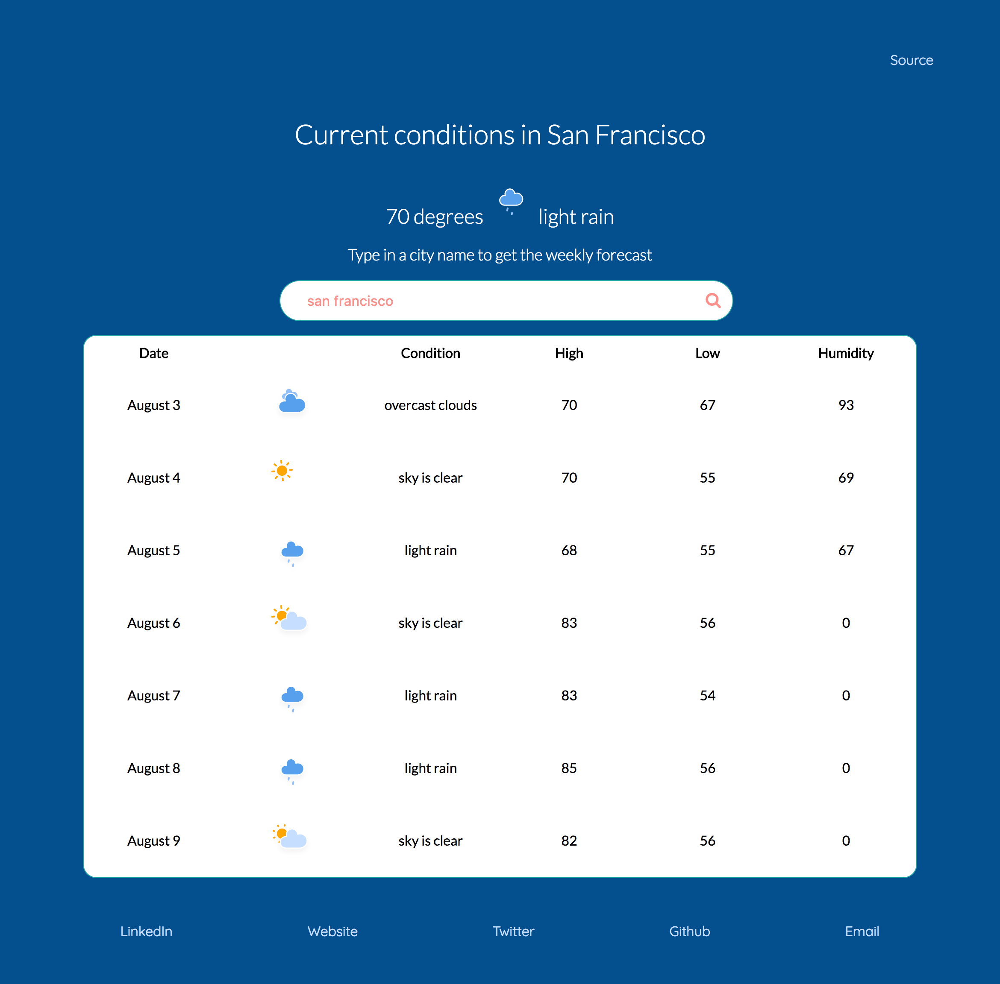

This is a little app that gets a weekly weather forecast for a user-entered city, using the .

## Intention:
- Set up a React app environment - using Webpack 3, Babel, and React.
- Pass state and props betweem components (this is very different from Vue - still getting the hang of it).
- Compose higher-order components (see [api notes section](#api-notes)).
- Set up SVG's as components, then reuse in different places (the current weather area + weather forecast table).
- Animate SVG components

## Design:
- Very simple, but there are some microinteractions and animations.
- Responsive.

## Logic:
- The app will initially try to get your location and display the current weather for your city.
- It will make another API call for forecast data after a user enters a city and clicks the search icon.

## Api Notes:
The `handleSubmit()` function in `~/src/components/complex/Forecast.jsx` needs to be refactored into an external component function. This would make it more functional and reusable which would cut down on code in `~/src/components/complex/Start.jsx` which uses a variation of this function. Need to understand setting state with functions better because currently having trouble getting the function results to return to the component state. See `~/src/components/complex/Api.jsx` for first attempt.

## Improve UX:
This is a simple little app but if I have more time these are improvements I'd like to add:
- Clear search city from input after search, or add icon and fucntion for user to clear it.
- Provide better fallback for current city conditions when user doesn't allow geolocation to be used.
- Tests!
- Update the current city conditions section with current conditions of city searched.
- Use `oninput` with a debounce function or just a `keyup` event might be better UX than the button click.

## Running Locally:
1. `git clone https://github.com/BeccaSheldon/react-weather-forecast.git`
2. `yarn` or `npm install`
3. `npm start` or `node_modules/.bin/webpack-dev-server` for hot reloading

## Screenshot:

#
####  Thanks for taking the time to check out this repo and README.<3
#